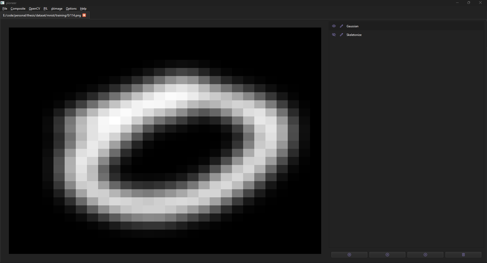

## Pioneer

Pioneer is a tool to explore image processing techniques using a graphics editor. The objective was to explore the effects and relationships between image processing techniques from different packages (e.g., OpenCV, PIL and skimage), and determine settings that could be used for accurate image segmentation in my [undergraduate thesis](https://github.com/braycarlson/thesis).

It is capable of editing multiple images, previewing changes in real-time, zooming in and out of the canvas, hiding/showing filters, re-ordering the filters, and caching the images and parameters for faster previewing.

<p align="center">
    
</p>

## Prerequisites

* [pyenv](https://github.com/pyenv/pyenv) or [Python 3.11.2](https://www.python.org/downloads/)

## Setup

### pyenv

```
pyenv install 3.11.2
```

```
pyenv local 3.11.2
```

### Virtual Environment

```
python -m venv venv
```

#### Windows

```
"venv/Scripts/activate"
```

#### Unix

```
source venv/bin/activate
```

### Packages

```
pip install -U -r requirements.txt
```
